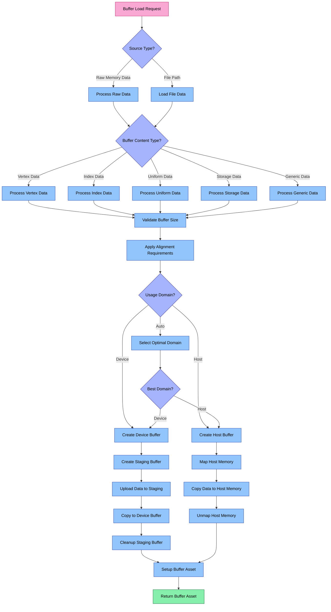

# Buffer Loader System

The Buffer Loader system is a specialized component of Aphrodite's resource management that handles creation, loading, and GPU resource allocation for various buffer assets.

## Architecture Overview

The Buffer Loader consists of key components that work together to efficiently handle different types of buffer data. The following diagram illustrates the complete decision flow from load request to final asset creation:



### Key Components

1. **BufferLoader**: Main class that orchestrates the buffer loading process
2. **BufferAsset**: Represents a loaded buffer in GPU memory
3. **BufferContentType**: Enum specifying the type of data contained in the buffer

## Buffer Loading Pipeline

The buffer loading process follows a systematic pipeline:

### 1. Source Data Handling
- Process raw memory data provided directly by the application
- Load data from file using the filesystem if a path is provided

### 2. Buffer Content Type Classification
- **Vertex Data**: Geometry vertex attributes
- **Index Data**: Geometry indices for indexed rendering
- **Uniform Data**: Shader uniform buffer data
- **Storage Data**: Shader storage buffer data
- **Generic Data**: General-purpose buffer data

### 3. Memory Domain Selection
- **Device Domain**: GPU-local memory (fastest for GPU reads, but not CPU accessible)
- **Host Domain**: CPU-accessible memory (mapped for direct CPU updates)
- **Auto Selection**: Determine optimal domain based on usage pattern

### 4. Buffer Creation Path
- **Device Memory Path**:
  - Create a staging buffer in host-visible memory
  - Copy source data to staging buffer
  - Create the final buffer in device-local memory
  - Copy data from staging to device buffer
  - Clean up staging resources

- **Host Memory Path**:
  - Create buffer in host-visible memory
  - Map the memory
  - Copy source data directly
  - Optionally keep mapped for dynamic updates

### 5. Buffer Asset Setup
- Configure BufferAsset wrapper with buffer information
- Set debug metadata and tracking information
- Return the asset to the caller

## Usage

```cpp
// Basic buffer loading from memory
aph::BufferLoadInfo bufferLoadInfo{
    .debugName = "vertex_buffer",
    .data = vertices.data(),
    .dataSize = vertices.size() * sizeof(Vertex),
    .createInfo = {
        .size = vertices.size() * sizeof(Vertex),
        .usage = aph::BufferUsage::Vertex | aph::BufferUsage::Storage,
        .domain = aph::MemoryDomain::Device,
    },
    .contentType = aph::BufferContentType::Vertex
};

aph::BufferAsset* pBufferAsset = nullptr;
loadRequest.add(bufferLoadInfo, &pBufferAsset);
loadRequest.load();

// Access the buffer
vk::Buffer* buffer = pBufferAsset->getBuffer();
```

## Advanced Features

### Multiple Usage Flags
```cpp
// Buffer with multiple usage types
bufferLoadInfo.createInfo.usage = 
    aph::BufferUsage::Vertex | 
    aph::BufferUsage::Storage | 
    aph::BufferUsage::TransferSrc;
```

### Dynamic Updates
```cpp
// Create a host-visible buffer for frequent updates
bufferLoadInfo.createInfo.domain = aph::MemoryDomain::Host;

// Later, update the buffer
void* data = pBufferAsset->map();
memcpy(data, newData, dataSize);
pBufferAsset->unmap();
```

### Device Address Usage
```cpp
// Enable buffer device address for ray tracing or advanced compute
bufferLoadInfo.createInfo.usage |= aph::BufferUsage::ShaderDeviceAddress;
```

## Performance Considerations

The Buffer Loader system includes several optimizations:

1. **Memory Domain Selection**: Automatically selects the optimal memory domain based on usage
2. **Alignment Handling**: Properly handles alignment requirements for different buffer types
3. **Efficient Transfers**: Uses command buffers and proper synchronization for transfers
4. **Memory Mapping**: Provides direct memory access for host-visible buffers
5. **Resource Tracking**: Maintains ownership and lifetime information

### Decision Flow Explanation

The diagram illustrates the complete decision flow in the Buffer Loader:

1. **Initial Data Source Check**:
   - Raw memory data is processed directly
   - File paths are loaded via the filesystem

2. **Buffer Type Classification**:
   - Determines the buffer's content type
   - Applies type-specific processing requirements

3. **Memory Requirements**:
   - Validates buffer size
   - Applies alignment requirements based on content type and usage

4. **Domain Selection**:
   - Determines whether to create a device-local or host-visible buffer
   - Makes automatic selection if not explicitly specified

5. **Creation Path**:
   - Device-local buffers use staging buffer for upload
   - Host-visible buffers use direct memory mapping

6. **Asset Finalization**:
   - Wraps the GPU buffer with BufferAsset interface
   - Sets up metadata and tracking information 