# Geometry Loader System

The Geometry Loader system is a specialized component of Aphrodite's resource management that handles loading, processing, and GPU resource creation for 3D model assets.

## Architecture Overview

The Geometry Loader consists of several key components that work together to efficiently handle various 3D model formats. The following diagram illustrates the complete decision flow from load request to final asset creation:

```mermaid
graph TD
    Request[Geometry Load Request] --> DataCheck{Source Type?}
    
    DataCheck -->|File Path| FormatDetect[Detect File Format]
    DataCheck -->|Raw Data| RawPath[Process Raw Geometry]
    
    FormatDetect --> FormatCheck{Format Type?}
    FormatCheck -->|GLTF/GLB| GLTFLoad[Process GLTF]
    FormatCheck -->|OBJ| OBJLoad[Process OBJ]
    FormatCheck -->|FBX| FBXLoad[Process FBX]
    FormatCheck -->|Custom| CustomLoad[Process Custom]
    
    GLTFLoad --> ProcessMesh[Process Mesh Data]
    OBJLoad --> ProcessMesh
    FBXLoad --> ProcessMesh
    CustomLoad --> ProcessMesh
    RawPath --> ProcessMesh
    
    ProcessMesh --> OptimizationCheck{Optimize?}
    OptimizationCheck -->|Yes| ApplyOptimizations[Apply Optimizations]
    OptimizationCheck -->|No| SkipOptimization[Skip Optimization]
    
    ApplyOptimizations --> VertexCacheOpt[Vertex Cache Optimization]
    VertexCacheOpt --> OverdrawOpt[Overdraw Optimization]
    OverdrawOpt --> VertexFetchOpt[Vertex Fetch Optimization]
    VertexFetchOpt --> WeldVerts[Weld Vertices]
    WeldVerts --> ThresholdCheck
    
    SkipOptimization --> ThresholdCheck[Check Mesh Size Thresholds]
    
    ThresholdCheck --> RenderPathCheck{Render Path?}
    RenderPathCheck -->|Traditional Pipeline| TraditionalPath[Create Traditional Mesh]
    RenderPathCheck -->|Mesh Shading| MeshShadingPath[Create Mesh Shader Compatible]
    
    TraditionalPath --> CreateVertexBuffer[Create Vertex Buffer]
    CreateVertexBuffer --> CreateIndexBuffer[Create Index Buffer]
    CreateIndexBuffer --> BuildBVH[Build Bounding Volume Hierarchy]
    
    MeshShadingPath --> BuildMeshlets[Build Meshlets]
    BuildMeshlets --> CreateMeshletBuffer[Create Meshlet Buffer]
    CreateMeshletBuffer --> CreatePrimitiveBuffer[Create Primitive Indices Buffer]
    CreatePrimitiveBuffer --> CreateVertexIndicesBuffer[Create Vertex Indices Buffer]
    CreateVertexIndicesBuffer --> CreateVertexBuffer
    
    BuildBVH --> MaterialCheck{Has Materials?}
    CreatePrimitiveBuffer --> BuildBVH
    
    MaterialCheck -->|Yes| ProcessMaterials[Process Materials]
    MaterialCheck -->|No| SetupAsset[Setup Geometry Asset]
    
    ProcessMaterials --> LoadTextures[Load Referenced Textures]
    LoadTextures --> SetupMaterials[Setup Material Parameters]
    SetupMaterials --> SetupAsset
    
    SetupAsset --> ReturnAsset[Return Geometry Asset]
    
    classDef request fill:#f9a8d4,stroke:#be185d,color:#000,stroke-width:1px
    classDef process fill:#93c5fd,stroke:#1e40af,color:#000,stroke-width:1px
    classDef decision fill:#a5b4fc,stroke:#3730a3,color:#000,stroke-width:1px
    classDef output fill:#86efac,stroke:#166534,color:#000,stroke-width:1px
    
    class Request request
    class DataCheck,FormatCheck,OptimizationCheck,RenderPathCheck,MaterialCheck decision
    class FormatDetect,GLTFLoad,OBJLoad,FBXLoad,CustomLoad,RawPath,ProcessMesh,ApplyOptimizations,SkipOptimization,VertexCacheOpt,OverdrawOpt,VertexFetchOpt,WeldVerts,ThresholdCheck,TraditionalPath,MeshShadingPath,CreateVertexBuffer,CreateIndexBuffer,BuildBVH,BuildMeshlets,CreateMeshletBuffer,CreatePrimitiveBuffer,CreateVertexIndicesBuffer,ProcessMaterials,LoadTextures,SetupMaterials,SetupAsset process
    class ReturnAsset output
```



### Key Components

1. **GeometryLoader**: Main class that orchestrates the geometry loading process
2. **GeometryAsset**: Represents a loaded 3D model in GPU memory
3. **GeometryData**: In-memory representation of geometry data before GPU upload
4. **MeshOptimizer**: Utilities for optimizing mesh data
5. **MeshletBuilder**: Utilities for building meshlet data for mesh shading

## Geometry Loading Pipeline

The geometry loading process follows a sophisticated pipeline:

### 1. Format Detection and Processing
- **GLTF/GLB**: Industry-standard 3D model format with comprehensive feature support
- **OBJ**: Common mesh format with wide compatibility
- **FBX**: Complex format supporting animation and advanced material features
- **Custom Formats**: Engine-specific optimized formats

### 2. Mesh Data Processing
- Extract vertex attributes (position, normal, tangent, UV, etc.)
- Process index data for triangle representation
- Extract submesh information for multi-part models
- Process scene hierarchy (transforms, parent-child relationships)
- Handle joints and weights for skinned meshes

### 3. Mesh Optimization
- **Vertex Cache Optimization**: Reorder indices for better cache utilization
- **Overdraw Optimization**: Reorder triangles to minimize overdraw
- **Vertex Fetch Optimization**: Reorder vertices for better memory access patterns
- **Vertex Welding**: Combine duplicate vertices within a specified threshold
- **Triangle Filtering**: Remove degenerate triangles

### 4. Render Path Specialization
- **Traditional Pipeline**:
  - Create standard vertex and index buffers
  - Optimize for conventional vertex/fragment pipeline
  
- **Mesh Shading Pipeline**:
  - Build meshlets (small groups of triangles and vertices)
  - Create meshlet descriptor buffer
  - Create primitive and vertex indices buffers
  - Optimize for high-throughput mesh shader pipeline

### 5. Spatial Structure Building
- Construct bounding volume hierarchy (BVH)
- Compute bounding boxes for submeshes
- Prepare data structures for culling and intersection tests

### 6. Material Processing
- Extract material definitions from model
- Load referenced textures
- Set up PBR material parameters
- Create material parameter buffers

## Usage

```cpp
// Basic geometry loading
aph::GeometryLoadInfo geometryLoadInfo{
    .path = "model://cube.gltf",
    .debugName = "cube_model",
    .featureFlags = aph::GeometryFeatureBits::Shadows,
    .optimizationFlags = aph::GeometryOptimizationBits::All,
    .preferMeshShading = true
};

aph::GeometryAsset* pGeometryAsset = nullptr;
loadRequest.add(geometryLoadInfo, &pGeometryAsset);
loadRequest.load();

// Use the geometry
pCmd->bind(pGeometryAsset);
pCmd->draw(pGeometryAsset, submeshIndex);
```

## Advanced Features

### Optimization Control
```cpp
// Selective optimization flags
geometryLoadInfo.optimizationFlags = 
    aph::GeometryOptimizationBits::VertexCache | 
    aph::GeometryOptimizationBits::VertexFetch;
```

### Render Path Selection
```cpp
// Force traditional pipeline
geometryLoadInfo.preferMeshShading = false;

// Force mesh shading pipeline
geometryLoadInfo.preferMeshShading = true;
```

### Material Loading Control
```cpp
// Control material loading
geometryLoadInfo.loadMaterials = true;
geometryLoadInfo.textureLoadFlags = aph::ImageFeatureBits::GenerateMips | aph::ImageFeatureBits::sRGB;
```

### Custom Processing Hooks
```cpp
// Custom vertex processing function
geometryLoadInfo.vertexProcessCallback = [](aph::GeometryVertexData& vertexData) {
    // Custom processing logic
};
```

## Performance Optimization

The Geometry Loader system includes several optimizations:

1. **Mesh Optimizations**: Comprehensive set of performance-focused mesh optimizations
2. **Mesh Shading Support**: Next-generation rendering pipeline support
3. **Progressive Mesh LOD**: Level-of-detail system for distance-based simplification
4. **Vertex Format Optimization**: Compact vertex formats based on available attributes
5. **Asynchronous Loading**: Background thread loading for large models
6. **Scene Partitioning**: Automatic spatial partitioning for large scenes

### Decision Flow Explanation

The diagram illustrates the complete decision flow in the Geometry Loader:

1. **Initial Data Source Check**:
   - File paths are processed through format-specific loaders
   - Raw mesh data can be provided directly without file loading

2. **Format Specific Processing**:
   - Different formats have specialized import paths
   - All paths converge to a common mesh data representation

3. **Optimization Phase**:
   - Optional but recommended mesh optimization steps
   - Sequence of optimizations applied in specific order
   - Can be selectively enabled/disabled

4. **Render Path Decision**:
   - Traditional vertex/index buffer path for standard pipelines
   - Mesh shading path for advanced GPU pipelines
   - Both paths include proper memory management and synchronization

5. **Material Handling**:
   - Extraction of material parameters from source models
   - Association of materials with submeshes
   - Loading of referenced textures and resources

6. **Finalization**:
   - GeometryAsset creation and setup
   - Resource binding preparation
   - Return to caller 