# Image Loader System

The Image Loader system is a specialized component of Aphrodite's resource management that handles loading, processing, and GPU resource creation for texture and image assets.

## Architecture Overview

The Image Loader consists of several key components that work together to efficiently handle various image formats. The following diagram illustrates the complete decision flow from load request to final asset creation:

```mermaid
graph TD
    Request[Image Load Request] --> DataCheck{Data Type?}
    
    DataCheck -->|Raw Data| RawPath[Process Raw Data]
    DataCheck -->|File Path| ForceCheck{Force Reload?}
    
    ForceCheck -->|Yes| SkipCache[Skip Cache]
    ForceCheck -->|No| GenKey[Generate Cache Key]
    
    GenKey --> MemCacheCheck{Memory Cache?}
    MemCacheCheck -->|Yes| MemHit[Return Memory Cached]
    MemCacheCheck -->|No| FileCacheCheck{File Cache?}
    
    FileCacheCheck -->|Yes| FileLoad[Load from Cache File]
    FileCacheCheck -->|No| SkipCache
    
    SkipCache --> PathCheck{Path Type?}
    PathCheck -->|Cubemap| LoadCubemap[Load 6 Faces]
    PathCheck -->|Single Image| FormatCheck{File Format?}
    
    FormatCheck -->|KTX/KTX2| KTXLoad[Load KTX/KTX2]
    FormatCheck -->|PNG/JPG| StandardLoad[Load Standard Format]
    
    RawPath --> RawProcess[Create ImageData]
    LoadCubemap --> ValidateFaces[Validate All Faces]
    KTXLoad --> CheckTranscoding{Needs Transcoding?}
    StandardLoad --> CreateBaseLevel[Create Base Mip Level]
    
    CheckTranscoding -->|Yes| Transcode[Transcode Format]
    CheckTranscoding -->|No| ExtractKTXData[Extract Data]
    
    Transcode --> ExtractKTXData
    ValidateFaces --> AssembleCubemap[Assemble Cubemap]
    
    ExtractKTXData --> KTXMipCheck{Has Mipmaps?}
    CreateBaseLevel --> MipGenCheck{Generate Mipmaps?}
    AssembleCubemap --> MipGenCheck
    RawProcess --> MipGenCheck
    FileLoad --> ProcessCached[Process Cached Data]
    
    KTXMipCheck -->|Yes| UseExistingMips[Use Existing Mipmaps]
    KTXMipCheck -->|No| MipGenCheck
    
    MipGenCheck -->|No| SkipMips[Skip Mipmap Generation]
    MipGenCheck -->|Yes| MipGenStrategy{Mipmap Strategy}
    
    MipGenStrategy -->|Force CPU| CPUMips[Generate CPU Mipmaps]
    MipGenStrategy -->|Prefer GPU| GPUCheck{Has GPU Flags?}
    
    GPUCheck -->|Yes| DeferGPU[Defer to GPU Generation]
    GPUCheck -->|No| CPUMips
    
    MemHit --> CreateResources[Create GPU Resources]
    ProcessCached --> CreateResources
    UseExistingMips --> CreateResources
    SkipMips --> CreateResources
    CPUMips --> CacheMips[Write to Cache]
    CacheMips --> CreateResources
    DeferGPU --> CreateResources
    
    CreateResources --> ImageCreation[Create Image]
    ImageCreation --> UploadBaseLevel[Upload Base Level]
    
    UploadBaseLevel --> DeferredMipCheck{Deferred GPU Mipmaps?}
    DeferredMipCheck -->|Yes| GPUMipGen[Generate GPU Mipmaps]
    DeferredMipCheck -->|No| UploadMipCheck{Has Multiple Mips?}
    
    UploadMipCheck -->|Yes| UploadMips[Upload All Mip Levels]
    UploadMipCheck -->|No| FinalTransition[Final State Transition]
    
    GPUMipGen -->|Success| FinalTransition
    GPUMipGen -->|Failure| CPUFallback[CPU Fallback]
    CPUFallback --> UploadMips
    
    UploadMips --> FinalTransition
    FinalTransition --> SetupAsset[Setup Image Asset]
    
    SetupAsset --> ReturnAsset[Return Image Asset]
    
    classDef request fill:#f9a8d4,stroke:#be185d,color:#000,stroke-width:1px
    classDef process fill:#93c5fd,stroke:#1e40af,color:#000,stroke-width:1px
    classDef decision fill:#a5b4fc,stroke:#3730a3,color:#000,stroke-width:1px
    classDef output fill:#86efac,stroke:#166534,color:#000,stroke-width:1px
    classDef cache fill:#fde68a,stroke:#92400e,color:#000,stroke-width:1px
    
    class Request request
    class DataCheck,ForceCheck,MemCacheCheck,FileCacheCheck,PathCheck,FormatCheck,CheckTranscoding,KTXMipCheck,MipGenCheck,MipGenStrategy,GPUCheck,DeferredMipCheck,UploadMipCheck decision
    class RawPath,SkipCache,LoadCubemap,KTXLoad,StandardLoad,RawProcess,ValidateFaces,Transcode,ExtractKTXData,AssembleCubemap,CreateBaseLevel,CPUMips,DeferGPU,ImageCreation,UploadBaseLevel,GPUMipGen,CPUFallback,UploadMips,FinalTransition,SetupAsset process
    class MemHit,FileLoad,ProcessCached,CacheMips cache
    class UseExistingMips,SkipMips,ReturnAsset output
```



### Key Components

1. **ImageLoader**: Main class that orchestrates the image loading process
2. **ImageAsset**: Represents a loaded texture in GPU memory
3. **ImageData**: In-memory representation of image data before GPU upload
4. **ImageCache**: Manages caching of images in memory and on disk
5. **ImageUtil**: Utility functions for format conversion and mipmap generation

## Image Loading Pipeline

The image loading process follows a sophisticated pipeline:

### 1. Cache Check
- Generate a unique cache key based on file path, dimensions, and load flags
- Check if the image exists in memory cache or file cache
- Return cached image if found, otherwise proceed to loading

### 2. Format Detection and Processing
- **KTX/KTX2**: Specialized optimized texture container format with built-in mipmaps and compression
- **Standard Formats**: PNG, JPEG, and other common formats loaded via stb_image
- **Cubemaps**: Special handling for six-face cubemap textures
- **Raw Data**: Direct pixel data processing without filesystem access

### 3. Mipmap Generation
- **GPU-based Generation (Preferred)**:
  - Uses Vulkan's blit functionality for hardware-accelerated mipmap generation
  - Higher performance and quality for real-time applications
  - Automatically falls back to CPU if requirements not met
  
- **CPU-based Generation**:
  - Software-based mipmap generation using box filtering algorithm
  - Used when GPU generation is not possible or explicitly requested
  - Required for caching to disk since GPU-generated mipmaps remain on the GPU

- **Configurable Strategy**:
  - `ePreferGPU`: Use GPU when possible, fall back to CPU (default)
  - `eForceGPU`: Only use GPU, fail if not possible
  - `eForceCPU`: Always use CPU generation

### 4. GPU Resource Creation
- Create staging buffers for data upload
- Initialize the GPU image with proper format and usage flags
- Upload image data to the GPU
- Generate mipmaps if needed
- Perform proper resource state transitions

### 5. Cache Management
- Store processed images on disk as KTX2 files
- Optionally apply Basis Universal compression
- Maintain in-memory cache for fast access to frequently used textures

## Usage

```cpp
// Basic image loading
aph::ImageLoadInfo imageLoadInfo{
    .debugName = "texture",
    .data = "texture://image.png",
    .createInfo = {
        .usage = aph::ImageUsage::Sampled,
        .domain = aph::MemoryDomain::Device
    },
    .featureFlags = aph::ImageFeatureBits::eGenerateMips
};

aph::ImageAsset* pImageAsset = nullptr;
loadRequest.add(imageLoadInfo, &pImageAsset);
loadRequest.load();

// Access the image
vk::Image* image = pImageAsset->getImage();
vk::ImageView* view = pImageAsset->getView();
```

## Advanced Features

### Mipmap Generation Control
```cpp
// Force CPU-based mipmap generation
imageLoadInfo.featureFlags |= aph::ImageFeatureBits::eForceCPUMipmaps;
```

### Cubemap Loading
```cpp
// Load a cubemap
imageLoadInfo.featureFlags |= aph::ImageFeatureBits::eCubemap;
imageLoadInfo.data = "texture://cubemap/skybox"; // Will load _posx, _negx, etc.
```

### Format Control
```cpp
// Load with specific format requirements
imageLoadInfo.createInfo.format = aph::Format::BC7_UNORM;
```

### Raw Data Loading
```cpp
// Load from raw pixel data
aph::ImageRawData rawData{
    .width = 512,
    .height = 512,
    .data = pixelData
};
imageLoadInfo.data = rawData;
```

### Compression Options
```cpp
// Use Basis Universal compression when caching
imageLoadInfo.featureFlags |= aph::ImageFeatureBits::eUseBasisUniversal;
```

## Performance Optimization

The Image Loader system includes several optimizations:

1. **Asynchronous Loading**: Load images in background threads
2. **Caching Strategy**: Two-level caching (memory and disk)
3. **GPU-accelerated Mipmap Generation**: Uses hardware for better performance
4. **Format Selection**: Automatically selects optimal GPU formats
5. **Memory Management**: Proper staging buffer usage and cleanup
6. **State Transitions**: Efficient resource state management 

### Decision Flow Explanation

The above diagram illustrates the complete decision flow in the Image Loader:

1. **Initial Data Check**:
   - Raw data is processed directly to an ImageData structure
   - File paths proceed to caching logic

2. **Cache Management**:
   - ForceReload flag determines whether to skip the cache
   - Cache key is generated based on file path, dimensions, and load flags
   - Memory cache is checked first, then file cache
   - Cache hits skip loading from source

3. **Path Classification**:
   - Cubemaps require loading and validating six individual faces
   - Individual image files follow format-specific paths

4. **Format-Specific Processing**:
   - KTX/KTX2 files may require Basis Universal transcoding
   - Standard formats (PNG/JPG) are loaded via stb_image
   - All paths converge to ImageData structures

5. **Mipmap Decision Logic**:
   - KTX files may already include mipmaps
   - Mipmap generation can be forced (CPU) or preferred (GPU)
   - GPU-based generation is deferred until GPU resource creation

6. **GPU Resource Creation**:
   - Image is created with appropriate format and usage flags
   - Base level is always uploaded first
   - GPU mipmaps are generated if deferred
   - CPU fallback is used if GPU generation fails
   - Multiple mip levels are uploaded individually

7. **Finalization**:
   - Final resource state transitions
   - Image asset structure setup
   - Return to caller 