# Shader Loader System

The Shader Loader system is a specialized component of Aphrodite's resource management that handles loading, compilation, and GPU shader program creation for rendering pipelines.

## Architecture Overview

The Shader Loader consists of several key components that work together to efficiently handle shader code compilation and loading. The following diagram illustrates the complete decision flow from load request to final asset creation:

```mermaid
graph TD
    Request[Shader Load Request] --> DataCheck{Source Type?}
    
    DataCheck -->|Slang Source| SlangPath[Process Slang Source]
    DataCheck -->|SPIRV Binary| SPIRVPath[Process SPIRV Binary]
    DataCheck -->|GLSL Source| GLSLPath[Process GLSL Source]

    SlangPath --> SlangCompiler[Slang Compiler Pipeline]
    SlangCompiler --> CheckCache{Cache Available?}
    
    CheckCache -->|Yes| LoadCache[Load from Cache]
    CheckCache -->|No| CompileSource[Compile from Source]
    
    CompileSource --> ConfigureSlang[Configure Slang Compiler]
    ConfigureSlang --> CheckModules{Has Modules?}
    
    CheckModules -->|Yes| LoadModules[Load Shader Modules]
    CheckModules -->|No| SkipModules[Skip Module Loading]
    
    LoadModules --> CompileStages[Compile Shader Stages]
    SkipModules --> CompileStages
    
    CompileStages --> StageCheck{Compilation Success?}
    StageCheck -->|Fail| ReportError[Report Compilation Error]
    StageCheck -->|Success| ReflectionAnalysis[Perform Reflection Analysis]
    
    ReflectionAnalysis --> ExtractAttributes[Extract Vertex Attributes]
    ExtractAttributes --> ExtractDescriptors[Extract Descriptor Bindings]
    ExtractDescriptors --> ExtractPushConstants[Extract Push Constants]
    ExtractPushConstants --> GenerateSPIRV[Generate SPIRV]
    
    GenerateSPIRV --> OptimizeSPIRV[Optimize SPIRV]
    OptimizeSPIRV --> ValidateSPIRV[Validate SPIRV]
    ValidateSPIRV --> WriteCacheFile[Write Cache File]
    WriteCacheFile --> SPIRVReady[SPIRV Ready]
    
    SPIRVPath --> SPIRVReady
    LoadCache --> SPIRVReady
    
    SPIRVReady --> CreateShaderModule[Create Shader Modules]
    
    GLSLPath --> GLSLCompiler[GLSL Compiler]
    GLSLCompiler --> GenerateSPIRV
    
    CreateShaderModule --> BindlessCheck{Uses Bindless?}
    BindlessCheck -->|Yes| RegisterBindlessResources[Register Bindless Resources]
    BindlessCheck -->|No| SkipBindless[Skip Bindless Registration]
    
    RegisterBindlessResources --> CreatePipelineLayout[Create Pipeline Layout]
    SkipBindless --> CreatePipelineLayout
    
    CreatePipelineLayout --> CreateSpecialization{Has Specialization?}
    CreateSpecialization -->|Yes| SetupSpecialization[Setup Specialization Constants]
    CreateSpecialization -->|No| SkipSpecialization[Skip Specialization]
    
    SetupSpecialization --> CreateProgram[Create Shader Program]
    SkipSpecialization --> CreateProgram
    
    CreateProgram --> SetupAsset[Setup Shader Asset]
    SetupAsset --> ReturnAsset[Return Shader Asset]
    
    ReportError --> FallbackCheck{Has Fallback?}
    FallbackCheck -->|Yes| UseFallback[Use Fallback Shader]
    FallbackCheck -->|No| ReturnError[Return Error]
    
    UseFallback --> ReturnAsset
    
    classDef request fill:#f9a8d4,stroke:#be185d,color:#000,stroke-width:1px
    classDef process fill:#93c5fd,stroke:#1e40af,color:#000,stroke-width:1px
    classDef decision fill:#a5b4fc,stroke:#3730a3,color:#000,stroke-width:1px
    classDef output fill:#86efac,stroke:#166534,color:#000,stroke-width:1px
    classDef error fill:#f87171,stroke:#991b1b,color:#000,stroke-width:1px
    
    class Request request
    class DataCheck,CheckCache,CheckModules,StageCheck,BindlessCheck,CreateSpecialization,FallbackCheck decision
    class SlangPath,SPIRVPath,GLSLPath,SlangCompiler,LoadCache,CompileSource,ConfigureSlang,LoadModules,SkipModules,CompileStages,ReflectionAnalysis,ExtractAttributes,ExtractDescriptors,ExtractPushConstants,GenerateSPIRV,OptimizeSPIRV,ValidateSPIRV,WriteCacheFile,SPIRVReady,CreateShaderModule,GLSLCompiler,RegisterBindlessResources,SkipBindless,CreatePipelineLayout,SetupSpecialization,SkipSpecialization,CreateProgram,SetupAsset,UseFallback process
    class ReturnAsset output
    class ReportError,ReturnError error
```



### Key Components

1. **ShaderLoader**: Main class that orchestrates the shader loading process
2. **SlangLoader**: Specialized loader for Slang shader language
3. **ShaderAsset**: Represents a compiled shader program in GPU memory
4. **ShaderCache**: Cache for compiled shader code and reflection data
5. **ShaderReflection**: Utilities for analyzing shader resource requirements

## Shader Loading Pipeline

The shader loading process follows a sophisticated pipeline:

### 1. Source Handling
- **Slang Source**: High-level shader language with advanced features
- **SPIRV Binary**: Pre-compiled SPIRV binaries for direct loading
- **GLSL Source**: Traditional GLSL shader source code

### 2. Slang Compilation Pipeline
- Initialize the Slang compiler with configuration options
- Load shader modules and dependencies
- Compile individual shader stages
- Error handling and diagnostic reporting
- Optimization passes

### 3. Reflection Analysis
- Extract vertex input attributes and their layout
- Analyze descriptor bindings and resource usage
- Extract push constant buffer layouts
- Determine pipeline layout requirements
- Generate reflection data for runtime usage

### 4. SPIRV Generation
- Convert Slang bytecode to SPIRV
- Perform optimization passes
- Validate generated SPIRV code
- Cache compiled SPIRV for future use

### 5. Shader Program Creation
- Create Vulkan shader modules
- Set up specialization constants
- Configure pipeline layout
- Register bindless resources
- Create final shader program object

### 6. Caching System
- Hash-based lookup of previously compiled shaders
- Disk caching of compiled SPIRV code
- Memory caching of loaded shader modules
- Reflection data caching

## Usage

```cpp
// Basic shader loading
aph::ShaderLoadInfo shaderLoadInfo{
    .debugName = "pbr_shader",
    .data = {"shader_slang://pbr.slang"},
    .stageInfo = {
        {aph::ShaderStage::VS, "vertMain"},
        {aph::ShaderStage::FS, "fragMain"}
    }
};

aph::ShaderAsset* pShaderAsset = nullptr;
loadRequest.add(shaderLoadInfo, &pShaderAsset);
loadRequest.load();

// Use the shader program
pCmd->setProgram(pShaderAsset->getProgram());
```

## Advanced Features

### Module System
```cpp
// Configure shader modules
aph::CompileRequest compileRequest;
compileRequest.addModule("common", "shader_slang://modules/common.slang");
compileRequest.addModule("pbr", "shader_slang://modules/pbr.slang");

// Set the shader info with compiler options
shaderLoadInfo.compileRequestOverride = compileRequest;
```

### Specialization Constants
```cpp
// Set up specialization constants
shaderLoadInfo.specializationConstants = {
    {0, 1},      // Constant ID 0 = value 1
    {1, 512},    // Constant ID 1 = value 512
    {2, 1.0f}    // Constant ID 2 = value 1.0f
};
```

### Bindless Resources
```cpp
// Enable bindless resources
shaderLoadInfo.pBindlessResource = pDevice->getBindlessResource();
```

### SPIRV Binary
```cpp
// Load pre-compiled SPIRV
aph::ShaderLoadInfo spirvShaderInfo{
    .debugName = "precompiled_shader",
    .data = {"spirv://precompiled.spv"},
    .stageInfo = {
        {aph::ShaderStage::CS, ""}  // Empty entry point for SPIRV
    }
};
```

## Performance Considerations

The Shader Loader system includes several optimizations:

1. **Asynchronous Compilation**: Shader compilation in background threads
2. **Caching Strategy**: Disk and memory caching to avoid recompilation
3. **SPIRV Optimization**: Multiple optimization passes for performance
4. **Incremental Compilation**: Only recompile changed shaders
5. **Pipeline State Caching**: Caching of pipeline state objects
6. **Hot Reloading**: Support for runtime shader code updates

### Decision Flow Explanation

The diagram illustrates the complete decision flow in the Shader Loader:

1. **Source Type Detection**:
   - Different source types follow specialized processing paths
   - Slang, SPIRV, and GLSL sources have dedicated pipelines

2. **Slang Compilation Process**:
   - Cache checking to avoid unnecessary recompilation
   - Module loading and dependency resolution
   - Compilation of individual shader stages with error handling
   - Comprehensive reflection analysis

3. **SPIRV Generation and Optimization**:
   - Generate optimized SPIRV from compiler output
   - Validate SPIRV code for correctness
   - Cache generated SPIRV for future use

4. **Shader Module Creation**:
   - Create Vulkan shader modules from SPIRV
   - Configure bindless resources if used
   - Set up pipeline layout based on reflection data
   - Apply specialization constants if specified

5. **Error Handling and Fallbacks**:
   - Detailed error reporting for compilation failures
   - Optional fallback shaders for critical paths
   - Debug information for shader development

6. **Asset Finalization**:
   - Wrap shader program in ShaderAsset interface
   - Set up metadata and tracking information
   - Return to caller 